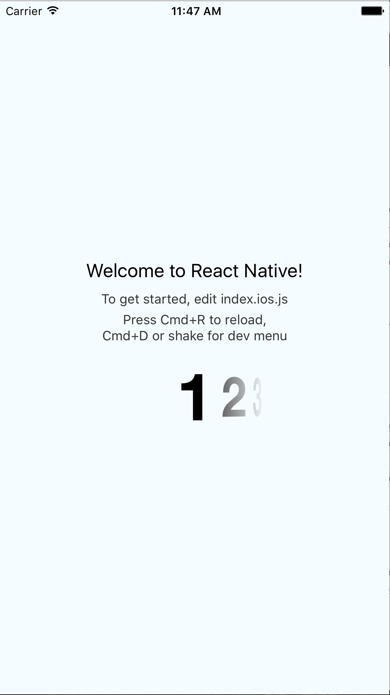

# react-native-horizontal-picker



## Add it to your project

You can try linking the project automatically:

`$ react-native link`

or do it manually as described below:

### iOS

- Run `npm install react-native-horizontal-picker --save`

or:

##### Manually

1. Open your project in XCode, right click on `Libraries` and click `Add
   Files to "Your Project Name"` Look under `node_modules/react-native-horizontal-picker` and add `RNTHorizontalPicker.xcodeproj`.
2. Add `libRNTHorizontalPicker.a` to `Build Phases -> Link Binary With Libraries`
3. Click on `libRNTHorizontalPicker.xcodeproj` in `Libraries` and go the `Build
   Settings` tab.

Then:


- Whenever you want to use it within React code now you can: `import HorizontalPicker from 'react-native-horizontal-picker';`

## Example

```javascript
<HorizontalPicker
  selectedIndex={0} //initial index can be set using this
  style={{ width: 150, height: 100, marginBottom: 4 }} //styles usually given to View component
  titles={[1, 2, 3, 4]} //can be an array of numbers or strings
  onChange={(event: Event) => { console.log('index of selected value', event.nativeEvent.newIndex); }}
/>
```

### To-do list

- [ ] Add test cases
- [ ] More UI customization support
- [ ] Android support
- [ ] Support for images

### Credit
This component is based on akkyie's component [AKPickerView](https://github.com/Akkyie/AKPickerView.git).
License: https://github.com/Akkyie/AKPickerView/blob/master/LICENSE

### License

MIT.
